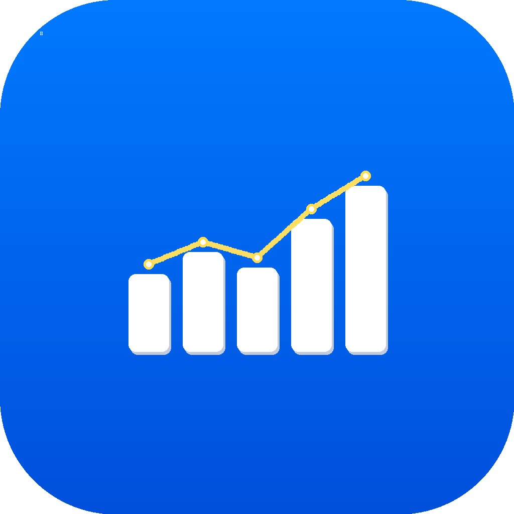

# Balance

A money app for your Mac. Track what you spend, what you earn, and what you own
— all of it stored on your own computer.

**Nothing leaves your Mac.** There is no account to make and no server to sign
in to. Your figures live in one file on your own disk.

## Install

You need a Mac with Apple silicon (an M1, M2, M3 or M4 chip). To check, open the
Apple menu, then **About This Mac** — the Chip line should say Apple, not Intel.

**1.** Download `Balance-macOS-arm64.zip` from the
[latest release](../../releases/latest) and double-click to unzip.

**2.** Drag `Balance.app` into your Applications folder.

**3.** Open **Terminal** (press Cmd+Space, type Terminal, press Return), paste
this line and press Return:

```
xattr -cr /Applications/Balance.app
```

Nothing will print. That is normal. Now open Balance from your Applications
folder. You only need this once — the app is not signed with a paid Apple
developer certificate, so macOS blocks it until you clear the flag.

## Getting later versions

Quit Balance, then paste this into Terminal:

```
curl -fsSL https://raw.githubusercontent.com/JuliusPaulin/balance-app/main/update.sh | bash
```

It fetches the newest release, installs it and clears the macOS block. Your
figures are untouched — they live outside the app.

## What it does

- **Transactions** — add, edit, delete and filter expenses and income
- **CSV import** — Finnish bank statements, Nordea account and Platinum exports,
  Finnair credit card
- **Auto-categories** — merchant rules (exact, contains, fuzzy) sort rows for
  you, with a live preview while you write a rule and one-click re-apply to past
  transactions
- **Dashboard** — month by month spend against income, category breakdown, daily
  totals and annual reports
- **Spending heatmap** — a year calendar you can drill into by day
- **Net worth** — accounts, loans and investment holdings over time
- **Split costs** — halve every imported amount in one click, for shared spending
- **Month notes** — attach context to any month
- **Auto-backup** — a safe snapshot before every import and on quit

## Your data

Everything is written to one SQLite file:

```
~/Library/Application Support/Balance/expenses.db
```

Rebuilding or reinstalling the app never touches it. To move Balance to another
Mac, copy that file across. To start again, delete it.

## Build it yourself

You need Python 3.11 and an Apple silicon Mac.

```
git clone https://github.com/JuliusPaulin/balance-app.git
cd balance-app
pip3 install -r requirements.txt
python3 -m PyInstaller Balance.spec --noconfirm --clean
```

The app lands in `dist/Balance.app`. To install what you just built:

```
rm -rf /Applications/Balance.app && ditto dist/Balance.app /Applications/Balance.app
```

Run it from source instead, without packaging:

```
python3 main.py
```

Both read the same database, so your figures carry over either way.

### Tests

```
python3 -m pytest test_import_formats.py
```

The import tests are the ones that matter for CSV work. Parts of the wider
suite still expect the old hosted Postgres setup and fail on this branch.

## Built with

Python, Flask and pywebview, packaged with PyInstaller.
